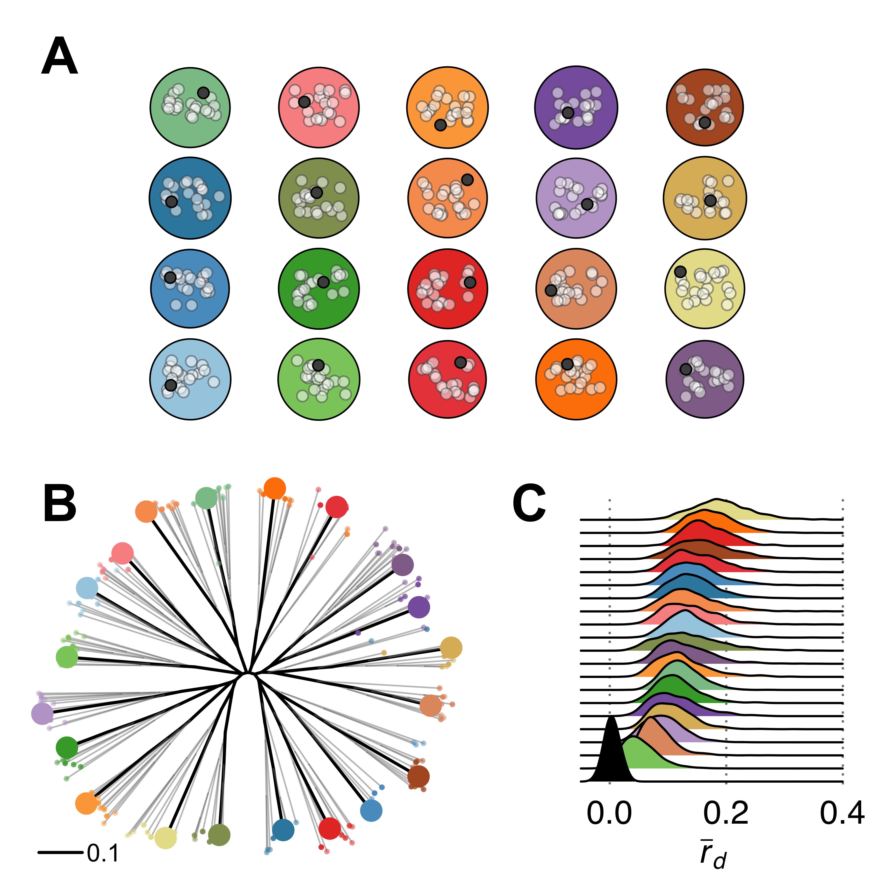

# Analysis for review of *S. sclerotiorum* mycelial compatibility groups

[](http://choosealicense.com/licenses/mit/)

This repository contains code for a meta analysis of mycelial compatibility
groups in the *Sclerotinia sclerotiorum* literature.

A preprint version of the manuscript submitted to Tropical Plant Pathology can be found here:

> Kamvar ZN, Everhart SE. (2018) Something in the agar does not compute: On the
> discriminatory power of mycelial compatibility in _Sclerotinia sclerotiorum_.
> PeerJ Preprints 6:e26670v1 doi: [10.7287/peerj.preprints.26670v1](https://doi.org/10.7287/peerj.preprints.26670v1)

## Manuscript

The manuscript is built with pandoc and xelatex and controlled with GNU make.
If you have those installed, you can rebuild the PDF and word version of the
manuscript with:

```
make -C manuscript
```

### Details of how manuscript was written and generated into pdf/word

The manuscript was originally written in Google Docs with the Paperpile plugin
for citations for the sake of an easy collaboration tool. Because there were
some formatting issues with the citations in Paperpile, we had downloaded the
[citations in BibTeX format](manuscript/references.bib)  and the [manuscript as
a word doc](manuscript/MCG%20Review%20-%20BibTeX.docx) with  BibTeX citation codes.
This was then converted to markdown with pandoc with the BibTeX citation codes
translated to pandoc citation codes, yaml headers added, and tables and figures
interspersed within the [markdown manuscript](manuscript/review.md).

From there, the manuscript could be built into pdf and word formats. However,
because of some unknown (and quite frustrating) errors in the bibliography not
parsing *some* italicized names, we manually copied and fixed the bibilographic
entries from the intermediate tex file into [a new tex file of correctly
formatted citations](manuscript/formatted-citations.tex). The citations in the
intermediate tex file are then replaced using the script
[replace-citatons.sh](manuscript/replace-citations.sh). Because pandoc's
`institute` yaml header wasn't giving us an affiliation for Dr. Everhart and
myself, we replaced the line in the intermediate tex file with [the corrected
affiliations](manuscript/formatted-citations.tex).

## Simulation code

While this is a review paper, we simulated 20 populations to generate figure 2:



The results of these simulations can be found in the [output markdown
file](results/kamvar2017population.md). If you would like to run these
simulations yourself, you will need R and GNU make. Once you have these tools,
you can type:

```
make
```

or, if you would rather have an html version, you can type:

```
make results/kamvar2017populations.html
```

This will install the internal simulation package [`kop`](code/kop/DESCRIPTION)
(with dependencies), install the [code dependencies](DESCRIPTION) and then run
the [simulation Rmarkdown file](code/kamvar2017populations.Rmd).

> These simulations are individual-based forward-time simulations which will
> use 4 processing cores. It's not uncommon for the process to take 20
> minutes to complete. For convenience, the results will be cached so
> subsequent runs will take considerably less time.
