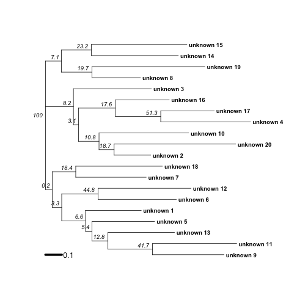
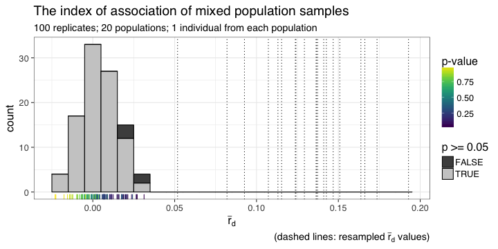

Introduction
=============

This document will test the hypothesis that mycelial compatibility groups will
deliniate sexually recombining populations of *Sclerotinia sclerotiorum*. In
this document, we are using data from @kamvar2017data, which consists of 366
isolates of *S. sclerotiorum* sampled over 11 states in the United States of
America, as well as Australia, France, and Mexico.

If this hypothesis is true, we expect to find no signatures of linkage within
the data before or after clone correction. We will be measuring clone-correction
via the standardized index of association, $\bar{r}_d$ as implemented in the
*poppr* package [@agapow2001indices; @kamvar2014poppr].

Packages and Data
-----------------

Here we are loading the data and packages necessary for the analyses. 


```r
library("poppr")
library("tidyverse")
```

Now that the packages are loaded, we can load the data:


```r
data_cols <- cols(
  .default = col_integer(),
  Severity = col_double(),
  Region = col_character(),
  Source = col_character(),
  Host = col_character()
)
dat <- readr::read_csv(here::here("data/kamvar2017population.csv"), col_types = data_cols)
dat
```

```
## # A tibble: 366 x 23
##    Severity   MCG Region Source  Year  Host Isolate `5-2(F)` `5-3(F)` `6-2(F)` `7-2(F)`
##       <dbl> <int>  <chr>  <chr> <int> <chr>   <int>    <int>    <int>    <int>    <int>
##  1      3.9     4     NE    unk  2003    GH     152      320      328      489      172
##  2      5.4    45     NE    unk  2003    GH     274      320      328      489      172
##  3      6.3     5     NY    unk  2003    GH     443      324      308      483      172
##  4      4.4     4     MN    wmn  2003  G122     444      320      328      489      172
##  5      4.7     4     MN    wmn  2003 Beryl     445      320      328      489      172
##  6      6.1     3     MI    wmn  2003 Beryl     446      322      339      483      172
##  7      5.5     5     MI    wmn  2003 Beryl     447      322      308      483      172
##  8      5.0     3     MI    wmn  2003 Beryl     448      324      339      483      172
##  9      5.2     3     MI    wmn  2003 Bunsi     449      322      339      483      172
## 10      5.3     5     MI    wmn  2003 Bunsi     450      322      308      483      172
## # ... with 356 more rows, and 12 more variables: `8-3(H)` <int>, `9-2(F)` <int>,
## #   `12-2(H)` <int>, `17-3(H)` <int>, `20-3(F)` <int>, `36-4(F)` <int>, `50-4(F)` <int>,
## #   `55-4(F)` <int>, `92-4(F)` <int>, `106-4(H)` <int>, `110-4(H)` <int>,
## #   `114-4(H)` <int>
```

Since these are the data for the 16 loci, we only want to keep the 11 that were
used for the study:


```r
replen <- c(
"5-2(F)" = 2,
"5-3(F)" = 4,
"6-2(F)" = 5.99999,
"7-2(F)" = 2,
"8-3(H)" = 2,
"9-2(F)" = 2,
"12-2(H)" = 2,
"17-3(H)" = 3,
"20-3(F)" = 2,
"36-4(F)" = 4,
"50-4(F)" = 4,
"55-4(F)" = 4,
"92-4(F)" = 2,
"106-4(H)" = 4,
"110-4(H)" = 3.99999,
"114-4(H)" = 4
)
loci_to_keep <- c("5-2(F)", "6-2(F)", "7-2(F)", "8-3(H)", "9-2(F)", "12-2(H)", 
"17-3(H)", "20-3(F)", "55-4(F)", "110-4(H)", "114-4(H)")
```

Now we can use these to subset our data:


```r
dat11 <- dat %>% 
  select(loci_to_keep) %>%
  df2genind(strata = select(dat, Region, Source, Host, MCG, Year), 
            ind.names = dat$Isolate,
            ploidy = 1) %>%
  as.genclone()
stopifnot(nLoc(dat11) == 11L)
stopifnot(nmll(dat11) == 165L)
other(dat11)$REPLEN <- replen
other(dat11)$meta <- dat %>% select(Severity, Isolate)
setPop(dat11) <- ~Region
dat11
```

```
## 
## This is a genclone object
## -------------------------
## Genotype information:
## 
##    165 original multilocus genotypes 
##    366 haploid individuals
##     11 codominant loci
## 
## Population information:
## 
##      5 strata - Region, Source, Host, MCG, Year
##     14 populations defined - NE, NY, MN, ..., France, Mexico, ND
```

Index of Association
====================

By MCG
--------

When we assess this by MCG, we need to first ensure that we are not drastically
reducing our sample size because there is evidence that small sample sizes
reduces the power of the index of association and can make clonal populations
appear to be sexual.


```r
dat11 %>% 
  setPop(~MCG) %>%                   # set population to MCGs
  selPopSize(n = 10) %>%             # constrain to 10 samples per population
  poppr(sample = 999, total = FALSE) # test index of association for each pop
```


```
##   Pop  N MLG eMLG    SE    H     G lambda   E.5  Hexp   Ia  p.Ia rbarD  p.rD File
## 1   4 14   9 6.93 0.849 1.97  5.44  0.816 0.724 0.431 2.96 0.001 0.302 0.001    .
## 2  45 16   7 5.25 0.881 1.56  3.37  0.703 0.630 0.192 2.52 0.001 0.286 0.001    .
## 3   5 73  37 7.72 1.266 3.05 10.68  0.906 0.481 0.408 2.74 0.001 0.292 0.001    .
## 4   2 10   9 9.00 0.000 2.16  8.33  0.880 0.952 0.590 1.43 0.001 0.144 0.001    .
## 5  44 36  19 7.37 1.201 2.57  8.53  0.883 0.625 0.338 2.93 0.001 0.330 0.001    .
## 6   1 15  10 7.47 0.876 2.15  7.26  0.862 0.822 0.451 1.94 0.001 0.243 0.001    .
## 7  49 11   6 5.73 0.445 1.64  4.48  0.777 0.836 0.274 3.87 0.001 0.487 0.001    .
## 8   9 15   8 5.67 0.943 1.60  3.17  0.684 0.549 0.390 5.23 0.001 0.592 0.001    .
```

In terms of our hypothesis, that was underwhelming... What happens if we clone
correct our data? We'll use the scheme in [@kamvar2017data], adding MCG as the
highest level:


```r
dat11 %>% 
  setPop(~MCG) %>%                   # set population to MCGs
  selPopSize(n = 10) %>%             # constrain to 10 samples per population
  clonecorrect(~MCG/Region/Source/Host/Year, keep = 1) %>%
  poppr(sample = 999, total = FALSE) # test index of association for each pop
```


```
##   Pop  N MLG eMLG    SE    H     G lambda   E.5  Hexp   Ia  p.Ia rbarD  p.rD File
## 1   4 14   9 6.93 0.849 1.97  5.44  0.816 0.724 0.431 2.96 0.001 0.302 0.001    .
## 2  45 12   7 6.15 0.657 1.70  4.24  0.764 0.724 0.240 2.34 0.002 0.264 0.002    .
## 3   5 60  37 8.69 1.017 3.32 19.57  0.949 0.696 0.451 2.27 0.001 0.239 0.001    .
## 4   2  9   9 9.00 0.000 2.20  9.00  0.889 1.000 0.604 1.41 0.001 0.142 0.001    .
## 5  44 27  19 8.26 1.065 2.72 11.22  0.911 0.717 0.404 2.45 0.001 0.274 0.001    .
## 6   1 12  10 8.50 0.584 2.21  8.00  0.875 0.862 0.471 1.50 0.001 0.188 0.001    .
## 7  49  9   6 6.00 0.000 1.68  4.76  0.790 0.866 0.225 3.30 0.001 0.413 0.001    .
## 8   9 13   8 6.38 0.788 1.74  3.93  0.746 0.625 0.434 4.91 0.001 0.553 0.001    .
```

Okay, maybe that heirarchy is a bit... detailed. What happens if we go the
opposite way? What if we simply clone-corrected just on MCG?


```r
dat11 %>% 
  setPop(~MCG) %>%                   # set population to MCGs
  selPopSize(n = 10) %>%             # constrain to 10 samples per population
  clonecorrect(~MCG) %>% 
  poppr(sample = 999, total = FALSE) # test index of association for each pop
```


```
##   Pop  N MLG eMLG       SE    H  G lambda E.5  Hexp   Ia  p.Ia  rbarD  p.rD File
## 1   4  9   9    9 0.00e+00 2.20  9  0.889   1 0.551 1.26 0.002 0.1279 0.002    .
## 2  45  7   7    7 0.00e+00 1.95  7  0.857   1 0.372 1.51 0.009 0.1680 0.009    .
## 3   5 37  37   10 0.00e+00 3.61 37  0.973   1 0.509 1.61 0.001 0.1663 0.001    .
## 4   2  9   9    9 0.00e+00 2.20  9  0.889   1 0.604 1.41 0.001 0.1416 0.001    .
## 5  44 19  19   10 2.51e-07 2.94 19  0.947   1 0.489 1.28 0.001 0.1425 0.001    .
## 6   1 10  10   10 0.00e+00 2.30 10  0.900   1 0.489 0.78 0.003 0.0977 0.003    .
## 7  49  6   6    6 0.00e+00 1.79  6  0.833   1 0.315 3.12 0.003 0.3909 0.003    .
## 8   9  8   8    8 0.00e+00 2.08  8  0.875   1 0.575 3.04 0.001 0.3431 0.001    .
```


Okay. So far, we have no evidence for this hypothesis. But one of the issues
that we saw in Kamvar et al. 2017 was that these data reflected a clonal
population structure. One thing that I'm curious about is the results that were
obtained by @prugnolle2010apparent showing that individuals sampled from 
differentiated populations will have a lower index of association. I can test
this by simulating data.


Data Simulations
----------------

I've written a simulator in an R package called "kop" and am loading it here:


```r
library("doParallel")
```

```
## Loading required package: foreach
```

```
## 
## Attaching package: 'foreach'
```

```
## The following objects are masked from 'package:purrr':
## 
##     accumulate, when
```

```
## Loading required package: iterators
```

```
## Loading required package: parallel
```

```r
library("kop")
```

First step is to create some populations. Because I want to get a representative
from each population, I'm going to create 20 populations. These populations are
initially simulated from a multinomial distribution, but this often results in
extremely long branches for a tree:


```r
kop::pop_generator(mate_gen = 0, mu = 0.5) %>% 
  aboot(sample = 1, tree = "nj", dist = "dist", quiet = TRUE) %>%
  invisible()
```

```
## Beginning mating
```

```
## 
## I recorded 0 mutation events
```


To avoid this, I'm parameterizing the simulations thusly:

| Parameter | Value |
| --------- | ----- |
| Census Size | 1000 |
| Sample Size | 100 |
| Generations of random mating | 400 |
| Generations of clonal reproduction (after random mating) | 100 |
| Mutations/Generation (over all samples/loci) | 0.5 |

The random mating serves to shorten those long terminal branches. This is
important for ensuring that the populations we DO simulate are sufficiently 
different from each other.


```r
cl <- makeCluster(4)
registerDoParallel(cl, cores = 4)
set.seed(2017-11-21)
test <- foreach(seq_len(20), .combine = c, .packages = c("kop", "poppr", "dplyr", "purrr", "tibble")) %dopar% 
  pop_generator(n = 1000, mate_gen = 400, clone_gen = 100, mu = 0.5, verbose = FALSE)
stopCluster(cl)
test <- test %>%
  repool() %>%
  as.genclone()
strata(test) <- data.frame(pop = pop(test))
test
```

```
## 
## This is a genclone object
## -------------------------
## Genotype information:
## 
##     361 original multilocus genotypes 
##    2000 haploid individuals
##      11 codominant loci
## 
## Population information:
## 
##       1 stratum - pop
##      20 populations defined - 
## unknown_1, unknown_2, unknown_3, ..., unknown_18, unknown_19, unknown_20
```

```r
nAll(test)
```

```
##  locus 1  locus 2  locus 3  locus 4  locus 5  locus 6  locus 7  locus 8  locus 9 locus 10 
##       12       12       12       11       11       12       11       11       11       11 
## locus 11 
##       12
```

```r
plot(ape::nj(dist(test)), lab4ut = "axial", type = "unrooted", tip.col = adegenet::funky(nPop(test))[pop(test)])
```


We can see from this that the clonal reproduction reduced the number of unique
individuals quite a bit. If we test the index of association for these
populations, we can see that they are indeed clonal:


```r
poppr(test, total = FALSE, sample = 999) 
```


```
##           Pop   N MLG eMLG SE    H     G lambda   E.5  Hexp    Ia  p.Ia  rbarD  p.rD File
## 1   unknown_1 100  20   20  0 2.67 11.85  0.916 0.811 0.486 1.211 0.001 0.1242 0.001 test
## 2   unknown_2 100  18   18  0 2.71 13.51  0.926 0.893 0.472 0.569 0.001 0.0633 0.001 test
## 3   unknown_3 100  15   15  0 2.11  5.95  0.832 0.682 0.437 1.897 0.001 0.2110 0.001 test
## 4   unknown_4 100  21   21  0 2.74 12.82  0.922 0.815 0.452 0.656 0.001 0.0760 0.001 test
## 5   unknown_5 100  21   21  0 2.64 10.46  0.904 0.730 0.529 1.083 0.001 0.1084 0.001 test
## 6   unknown_6 100  15   15  0 2.32  7.94  0.874 0.752 0.502 1.524 0.001 0.1559 0.001 test
## 7   unknown_7 100  19   19  0 2.70 12.17  0.918 0.804 0.468 0.958 0.001 0.0970 0.001 test
## 8   unknown_8 100  15   15  0 2.36  8.36  0.880 0.768 0.458 1.021 0.001 0.1045 0.001 test
## 9   unknown_9 100  16   16  0 2.50 10.18  0.902 0.822 0.581 1.735 0.001 0.1741 0.001 test
## 10 unknown_10 100  19   19  0 2.63 11.01  0.909 0.781 0.420 0.602 0.001 0.0670 0.001 test
## 11 unknown_11 100  17   17  0 2.54 10.66  0.906 0.829 0.596 1.298 0.001 0.1300 0.001 test
## 12 unknown_12 100  22   22  0 2.79 13.37  0.925 0.813 0.588 1.070 0.001 0.1075 0.001 test
## 13 unknown_13 100  14   14  0 2.37  8.87  0.887 0.807 0.534 1.240 0.001 0.1379 0.001 test
## 14 unknown_14 100  18   18  0 2.62 11.11  0.910 0.797 0.466 1.429 0.001 0.1563 0.001 test
## 15 unknown_15 100  19   19  0 2.71 13.05  0.923 0.859 0.553 1.038 0.001 0.1038 0.001 test
## 16 unknown_16 100  17   17  0 2.58 11.44  0.913 0.857 0.461 1.223 0.001 0.1232 0.001 test
## 17 unknown_17 100  23   23  0 2.85 13.77  0.927 0.786 0.517 0.708 0.001 0.0715 0.001 test
## 18 unknown_18 100  18   18  0 2.63 11.60  0.914 0.821 0.570 1.356 0.001 0.1361 0.001 test
## 19 unknown_19 100  17   17  0 2.55 10.96  0.909 0.842 0.495 1.103 0.001 0.1172 0.001 test
## 20 unknown_20 100  17   17  0 2.60 11.01  0.909 0.799 0.475 0.883 0.001 0.0990 0.001 test
```

```r
poppr(test, clonecorrect = TRUE, total = FALSE, strata = ~pop, sample = 999)
```


```
##           Pop  N MLG eMLG       SE    H  G lambda E.5  Hexp        Ia  p.Ia     rbarD
## 1   unknown_1 20  20   14 0.00e+00 3.00 20  0.950   1 0.538  0.173768 0.082  1.75e-02
## 2   unknown_2 18  18   14 0.00e+00 2.89 18  0.944   1 0.527  0.004583 0.463  5.10e-04
## 3   unknown_3 15  15   14 0.00e+00 2.71 15  0.933   1 0.569  0.335556 0.028  3.75e-02
## 4   unknown_4 21  21   14 0.00e+00 3.04 21  0.952   1 0.505 -0.027569 0.604 -3.13e-03
## 5   unknown_5 21  21   14 0.00e+00 3.04 21  0.952   1 0.554  0.084335 0.220  8.45e-03
## 6   unknown_6 15  15   14 0.00e+00 2.71 15  0.933   1 0.545  0.000159 0.447  1.61e-05
## 7   unknown_7 19  19   14 3.79e-07 2.94 19  0.947   1 0.535  0.133998 0.150  1.36e-02
## 8   unknown_8 15  15   14 0.00e+00 2.71 15  0.933   1 0.528 -0.063656 0.668 -6.43e-03
## 9   unknown_9 16  16   14 0.00e+00 2.77 16  0.938   1 0.619  0.144477 0.178  1.45e-02
## 10 unknown_10 19  19   14 3.79e-07 2.94 19  0.947   1 0.489  0.021461 0.411  2.39e-03
## 11 unknown_11 17  17   14 1.60e-07 2.83 17  0.941   1 0.626  0.021510 0.442  2.16e-03
## 12 unknown_12 22  22   14 3.70e-07 3.09 22  0.955   1 0.600  0.115848 0.177  1.18e-02
## 13 unknown_13 14  14   14 0.00e+00 2.64 14  0.929   1 0.582 -0.104198 0.774 -1.16e-02
## 14 unknown_14 18  18   14 0.00e+00 2.89 18  0.944   1 0.529  0.324839 0.025  3.32e-02
## 15 unknown_15 19  19   14 3.79e-07 2.94 19  0.947   1 0.594  0.235258 0.068  2.36e-02
## 16 unknown_16 17  17   14 1.60e-07 2.83 17  0.941   1 0.505  0.257340 0.082  2.61e-02
## 17 unknown_17 23  23   14 0.00e+00 3.14 23  0.957   1 0.548 -0.160553 0.945 -1.61e-02
## 18 unknown_18 18  18   14 0.00e+00 2.89 18  0.944   1 0.617  0.189081 0.056  1.91e-02
## 19 unknown_19 17  17   14 1.60e-07 2.83 17  0.941   1 0.531  0.080380 0.227  8.21e-03
## 20 unknown_20 17  17   14 1.60e-07 2.83 17  0.941   1 0.488 -0.116947 0.778 -1.30e-02
##     p.rD File
## 1  0.082 test
## 2  0.463 test
## 3  0.028 test
## 4  0.604 test
## 5  0.220 test
## 6  0.447 test
## 7  0.150 test
## 8  0.668 test
## 9  0.178 test
## 10 0.411 test
## 11 0.442 test
## 12 0.177 test
## 13 0.774 test
## 14 0.025 test
## 15 0.068 test
## 16 0.082 test
## 17 0.945 test
## 18 0.056 test
## 19 0.227 test
## 20 0.778 test
```

We can see how they all are related (or not so) to each other


```r
aboot(test, ~pop, sample = 1000, dist = "nei.dist", tree = "nj")
```

```
## 
Running bootstraps:       100 / 1000
```

```
## Warning in infinite_vals_replacement(D, warning): Infinite values detected.
```

```
## 
Running bootstraps:       200 / 1000
```

```
## Warning in infinite_vals_replacement(D, warning): Infinite values detected.

## Warning in infinite_vals_replacement(D, warning): Infinite values detected.
```

```
## 
Running bootstraps:       300 / 1000
```

```
## Warning in infinite_vals_replacement(D, warning): Infinite values detected.

## Warning in infinite_vals_replacement(D, warning): Infinite values detected.

## Warning in infinite_vals_replacement(D, warning): Infinite values detected.
```

```
## 
Running bootstraps:       400 / 1000
```

```
## Warning in infinite_vals_replacement(D, warning): Infinite values detected.
```

```
## 
Running bootstraps:       500 / 1000
```

```
## Warning in infinite_vals_replacement(D, warning): Infinite values detected.

## Warning in infinite_vals_replacement(D, warning): Infinite values detected.

## Warning in infinite_vals_replacement(D, warning): Infinite values detected.
```

```
## 
Running bootstraps:       600 / 1000
Running bootstraps:       700 / 1000
```

```
## Warning in infinite_vals_replacement(D, warning): Infinite values detected.
```

```
## 
Running bootstraps:       800 / 1000
```

```
## Warning in infinite_vals_replacement(D, warning): Infinite values detected.
```

```
## 
Running bootstraps:       900 / 1000
```

```
## Warning in infinite_vals_replacement(D, warning): Infinite values detected.

## Warning in infinite_vals_replacement(D, warning): Infinite values detected.
```

```
## 
Running bootstraps:       1000 / 1000
## Calculating bootstrap values... done.
```



```
## 
## Phylogenetic tree with 20 tips and 18 internal nodes.
## 
## Tip labels:
## 	unknown_1, unknown_2, unknown_3, unknown_4, unknown_5, unknown_6, ...
## Node labels:
## 	100, 1.9, 0.1, 4.5, 2.8, 6.6, ...
## 
## Unrooted; includes branch lengths.
```

Now that we've set up the popualtions, we can randomly sample two individuals
from each and pool them together.


```r
# Sample one individual per population
sample_one <- quote(flatten_dbl(map(popNames(test), ~{ sample(which(pop(test) == .), 1) })))
subsamples <- replicate(100, test[eval(sample_one), ])
```


```r
cl <- makeCluster(4)
registerDoParallel(cl, cores = 4)
set.seed(2017-11-21)
res <- foreach(i = seq(subsamples), .combine = c, .packages = c("poppr")) %dopar% 
  list(ia(subsamples[[i]], sample = 999, valuereturn = TRUE, plot = FALSE, quiet = TRUE))
stopCluster(cl)

# reshaping everything into a data frame
resdf <- map(res, 1) %>% 
  map(as.list) %>% 
  bind_rows()
(resdf <- bind_cols(resdf, data_frame(sims = map(res, 2))))
```

```
## # A tibble: 100 x 5
##              Ia  p.Ia         rbarD  p.rD                   sims
##           <dbl> <dbl>         <dbl> <dbl>                 <list>
##  1 -0.007831015 0.529 -0.0007960794 0.529 <data.frame [999 x 2]>
##  2 -0.037082295 0.664 -0.0037582308 0.664 <data.frame [999 x 2]>
##  3  0.019440628 0.428  0.0019572343 0.428 <data.frame [999 x 2]>
##  4  0.031756259 0.792  0.0032535803 0.792 <data.frame [999 x 2]>
##  5 -0.119584838 0.917 -0.0120549541 0.917 <data.frame [999 x 2]>
##  6 -0.070920957 0.787 -0.0071306607 0.787 <data.frame [999 x 2]>
##  7 -0.057251536 0.718 -0.0057770677 0.718 <data.frame [999 x 2]>
##  8  0.040994881 0.722  0.0042047795 0.722 <data.frame [999 x 2]>
##  9 -0.041524960 0.672 -0.0041811073 0.672 <data.frame [999 x 2]>
## 10  0.017522959 0.448  0.0017786491 0.448 <data.frame [999 x 2]>
## # ... with 90 more rows
```

Now we can see what fraction of the simulations resulted in a significant value
of $\bar{r}_d$


```r
sum(resdf$p.rD <= 0.05)/nrow(resdf)
```

```
## [1] 0.03
```

That's not very many.

What do the data look like:


```r
ccia <- poppr(test, quiet = TRUE, total = FALSE)
the_plot <- resdf %>% 
  ggplot(aes(x = rbarD, fill = p.rD >= 0.05)) + 
  geom_histogram(binwidth = 0.01, position = "stack", color = "black") +
  geom_rug(aes(color = p.rD)) +
  viridis::scale_color_viridis() +
  scale_fill_manual(values = c("grey30", "grey80")) +
  theme_bw(base_size = 16, base_family = "Helvetica") +
  labs(list(
    fill = expression(paste("p >= 0.05")),
    color = "p-value",
    x = expression(paste(bar(r)[d])),
    title = "The index of association of mixed population samples",
    subtitle = "100 replicates; 20 populations; 1 individual from each population",
    caption = expression(paste("(dashed lines: observed ", bar(r)[d], " values)"))
  ))
the_plot + geom_vline(xintercept = ccia$rbarD, lty = 3)
```


What happens when we randomly sample 20 individuals from each population?


```r
set.seed(2017-11-21)
resampled_rbarD <- seppop(test) %>%
  map_df(resample.ia, n = 20, .id = "Population") %>%
  as_tibble()
resampled_rbarD_res <- resampled_rbarD %>% 
  group_by(Population) %>% 
  summarize(rbarD = mean(rbarD)) %>% 
  pull(rbarD)
the_plot + 
  geom_vline(xintercept = resampled_rbarD_res, lty = 3) +
  labs(caption = expression(paste("(dashed lines: resampled ", bar(r)[d], " values)")))
```




```r
ridgelines <- resdf %>% 
  select(Ia, rbarD) %>% 
  add_column(Population = "pooled") %>% 
  bind_rows(resampled_rbarD, .id = "Data") %>% 
  mutate(Data = case_when(Population == "pooled" ~ "pooled", TRUE ~ "single")) %>% 
  mutate(Population = case_when(
           grepl("unknown", Population) ~ sprintf("pop %2d", as.integer(gsub("unknown_", "", Population))),
           TRUE ~ Population
           )) %>% 
  group_by(Population) %>% 
  mutate(m = mean(rbarD)) %>% 
  arrange(m) %>% 
  select(-m) %>% 
  ungroup() %>% 
  mutate(Population = fct_inorder(Population))
```

```
## Warning in sprintf("pop %2d", as.integer(gsub("unknown_", "", Population))): NAs
## introduced by coercion
```

```r
p_ridge <- ggplot(ridgelines, aes(x = rbarD, y = Population, fill = Data, height = ..density..)) + 
  geom_density_ridges(scale = 5) +
  theme_ridges(font_size = 16, font_family = "Helvetica", grid = TRUE, center_axis_labels = TRUE) +
  scale_x_continuous(limits = c(NA, 0.4), breaks = c(0, 0.2, 0.4)) +
  scale_y_discrete(expand = c(0.01, 0)) +
  theme(aspect.ratio = 1.25) +
  theme(legend.position = "top") +
  theme(legend.justification = "center") +
  theme(axis.text.y = element_blank()) +
  theme(axis.ticks.y = element_blank()) +
  theme(axis.ticks.x = element_blank()) +
  theme(axis.title.y = element_blank()) +
  theme(panel.grid.major.y = element_blank()) +
  theme(panel.grid.major.x = element_line(linetype = 3, color = "grey50")) +
  scale_fill_manual(values = c("grey20", "grey80")) +
  labs(list(
    x = expression(paste(italic(bar(r)[d])))
  ))
```

```
## Error in geom_density_ridges(scale = 5): could not find function "geom_density_ridges"
```

```r
p_ridge
```

```
## Error in eval(expr, envir, enclos): object 'p_ridge' not found
```

```r
ggsave(p_ridge, filename = here::here("results/figures/p-ridge.pdf"))
```

```
## Saving 3.5 x 5 in image
```

```
## Error in grid.draw(plot): object 'p_ridge' not found
```


<details>
<summary>Session Information</summary>


```r
devtools::session_info()
```

```
## Session info ----------------------------------------------------------------------------
```

```
##  setting  value                       
##  version  R version 3.4.2 (2017-09-28)
##  system   x86_64, darwin15.6.0        
##  ui       X11                         
##  language (EN)                        
##  collate  en_US.UTF-8                 
##  tz       America/Chicago             
##  date     2017-12-04
```

```
## Packages --------------------------------------------------------------------------------
```

```
##  package     * version    date       source                             
##  ade4        * 1.7-8      2017-11-19 Github (sdray/ade4@2ee45cb)        
##  adegenet    * 2.1.0      2017-10-12 CRAN (R 3.4.2)                     
##  ape           5.0        2017-10-30 CRAN (R 3.4.2)                     
##  assertthat    0.2.0      2017-04-11 CRAN (R 3.4.0)                     
##  backports     1.1.1      2017-09-25 CRAN (R 3.4.2)                     
##  base        * 3.4.2      2017-10-04 local                              
##  bindr         0.1        2016-11-13 CRAN (R 3.4.0)                     
##  bindrcpp    * 0.2        2017-06-17 CRAN (R 3.4.0)                     
##  boot          1.3-20     2017-07-30 CRAN (R 3.4.1)                     
##  broom         0.4.2      2017-02-13 CRAN (R 3.4.0)                     
##  cellranger    1.1.0      2016-07-27 CRAN (R 3.4.0)                     
##  cli           1.0.0      2017-11-22 Github (r-lib/cli@ab1c3aa)         
##  cluster       2.0.6      2017-03-16 CRAN (R 3.4.0)                     
##  coda          0.19-1     2016-12-08 CRAN (R 3.4.0)                     
##  codetools     0.2-15     2016-10-05 CRAN (R 3.4.0)                     
##  colorspace    1.4-0      2017-11-23 R-Forge (R 3.4.2)                  
##  compiler      3.4.2      2017-10-04 local                              
##  crayon        1.3.4      2017-09-23 Github (gaborcsardi/crayon@b5221ab)
##  datasets    * 3.4.2      2017-10-04 local                              
##  DBI           0.7        2017-06-18 CRAN (R 3.4.0)                     
##  deldir        0.1-14     2017-04-22 CRAN (R 3.4.0)                     
##  devtools      1.13.3     2017-08-02 CRAN (R 3.4.1)                     
##  digest        0.6.12     2017-01-27 CRAN (R 3.4.0)                     
##  doParallel  * 1.0.11     2017-09-28 CRAN (R 3.4.1)                     
##  dplyr       * 0.7.4      2017-09-28 CRAN (R 3.4.1)                     
##  evaluate      0.10.1     2017-06-24 CRAN (R 3.4.1)                     
##  expm          0.999-2    2017-03-29 CRAN (R 3.4.0)                     
##  ezknitr       0.6        2016-09-16 CRAN (R 3.4.0)                     
##  fastmatch     1.1-0      2017-01-28 CRAN (R 3.4.0)                     
##  forcats     * 0.2.0      2017-01-23 CRAN (R 3.4.0)                     
##  foreach     * 1.4.3      2015-10-13 CRAN (R 3.4.0)                     
##  foreign       0.8-69     2017-06-21 CRAN (R 3.4.0)                     
##  gdata         2.18.0     2017-06-06 CRAN (R 3.4.0)                     
##  ggplot2     * 2.2.1      2016-12-30 CRAN (R 3.4.0)                     
##  glue          1.2.0      2017-10-29 CRAN (R 3.4.2)                     
##  gmodels       2.16.2     2015-07-22 CRAN (R 3.4.0)                     
##  graphics    * 3.4.2      2017-10-04 local                              
##  grDevices   * 3.4.2      2017-10-04 local                              
##  grid          3.4.2      2017-10-04 local                              
##  gridExtra     2.3        2017-09-09 CRAN (R 3.4.1)                     
##  gtable        0.2.0      2016-02-26 CRAN (R 3.4.0)                     
##  gtools        3.5.0      2015-05-29 CRAN (R 3.4.0)                     
##  haven         1.1.0      2017-07-09 CRAN (R 3.4.1)                     
##  here          0.1        2017-05-28 CRAN (R 3.4.0)                     
##  highr         0.6        2016-05-09 CRAN (R 3.4.0)                     
##  hms           0.3        2016-11-22 CRAN (R 3.4.0)                     
##  htmltools     0.3.6      2017-04-28 CRAN (R 3.4.0)                     
##  httpuv        1.3.5      2017-07-04 CRAN (R 3.4.1)                     
##  httr          1.3.1      2017-08-20 cran (@1.3.1)                      
##  igraph        1.1.2      2017-07-21 cran (@1.1.2)                      
##  iterators   * 1.0.8      2015-10-13 CRAN (R 3.4.0)                     
##  jsonlite      1.5        2017-06-01 CRAN (R 3.4.0)                     
##  knitr         1.17       2017-08-10 cran (@1.17)                       
##  kop         * 0.0.0.9000 2017-11-22 local (@0.0.0.9)                   
##  labeling      0.3        2014-08-23 CRAN (R 3.4.0)                     
##  lattice       0.20-35    2017-03-25 CRAN (R 3.4.0)                     
##  lazyeval      0.2.1      2017-10-29 CRAN (R 3.4.2)                     
##  LearnBayes    2.15       2014-05-29 CRAN (R 3.4.0)                     
##  lubridate     1.7.1      2017-11-03 CRAN (R 3.4.2)                     
##  magrittr      1.5        2014-11-22 CRAN (R 3.4.0)                     
##  MASS          7.3-47     2017-04-21 CRAN (R 3.4.0)                     
##  Matrix        1.2-11     2017-08-16 CRAN (R 3.4.1)                     
##  memoise       1.1.0      2017-04-21 CRAN (R 3.4.0)                     
##  methods     * 3.4.2      2017-10-04 local                              
##  mgcv          1.8-22     2017-09-19 CRAN (R 3.4.2)                     
##  mime          0.5        2016-07-07 CRAN (R 3.4.0)                     
##  mnormt        1.5-5      2016-10-15 CRAN (R 3.4.0)                     
##  modelr        0.1.1      2017-07-24 CRAN (R 3.4.1)                     
##  munsell       0.4.3      2016-02-13 CRAN (R 3.4.0)                     
##  nlme          3.1-131    2017-02-06 CRAN (R 3.4.0)                     
##  parallel    * 3.4.2      2017-10-04 local                              
##  pegas         0.10       2017-05-03 CRAN (R 3.4.0)                     
##  permute       0.9-4      2016-09-09 CRAN (R 3.4.0)                     
##  phangorn      2.3.1      2017-11-01 CRAN (R 3.4.2)                     
##  pkgconfig     2.0.1      2017-03-21 CRAN (R 3.4.0)                     
##  plyr          1.8.4      2016-06-08 CRAN (R 3.4.0)                     
##  poppr       * 2.5.0      2017-09-11 CRAN (R 3.4.1)                     
##  psych         1.7.8      2017-09-09 CRAN (R 3.4.1)                     
##  purrr       * 0.2.4      2017-10-18 cran (@0.2.4)                      
##  quadprog      1.5-5      2013-04-17 CRAN (R 3.4.0)                     
##  R.methodsS3   1.7.1      2016-02-16 CRAN (R 3.4.0)                     
##  R.oo          1.21.0     2016-11-01 CRAN (R 3.4.0)                     
##  R.utils       2.6.0      2017-11-05 CRAN (R 3.4.2)                     
##  R6            2.2.2      2017-06-17 cran (@2.2.2)                      
##  Rcpp          0.12.13    2017-09-28 CRAN (R 3.4.2)                     
##  readr       * 1.1.1      2017-05-16 CRAN (R 3.4.0)                     
##  readxl        1.0.0      2017-04-18 CRAN (R 3.4.0)                     
##  reshape2      1.4.2      2016-10-22 CRAN (R 3.4.0)                     
##  rlang         0.1.4      2017-11-05 CRAN (R 3.4.2)                     
##  rprojroot     1.2        2017-01-16 CRAN (R 3.4.0)                     
##  rstudioapi    0.7        2017-09-07 CRAN (R 3.4.1)                     
##  rvest         0.3.2      2016-06-17 CRAN (R 3.4.0)                     
##  scales        0.5.0.9000 2017-08-28 Github (hadley/scales@d767915)     
##  seqinr        3.4-5      2017-08-01 CRAN (R 3.4.1)                     
##  shiny         1.0.5      2017-08-23 cran (@1.0.5)                      
##  sp            1.2-5      2017-06-29 CRAN (R 3.4.1)                     
##  spdep         0.6-15     2017-09-01 CRAN (R 3.4.1)                     
##  splines       3.4.2      2017-10-04 local                              
##  stats       * 3.4.2      2017-10-04 local                              
##  stringi       1.1.5      2017-04-07 CRAN (R 3.4.0)                     
##  stringr     * 1.2.0      2017-02-18 CRAN (R 3.4.0)                     
##  tibble      * 1.3.4      2017-08-22 cran (@1.3.4)                      
##  tidyr       * 0.7.2      2017-10-16 CRAN (R 3.4.2)                     
##  tidyverse   * 1.2.1      2017-11-14 cran (@1.2.1)                      
##  tools         3.4.2      2017-10-04 local                              
##  utils       * 3.4.2      2017-10-04 local                              
##  vegan         2.4-4      2017-08-24 cran (@2.4-4)                      
##  viridis       0.4.0      2017-03-27 CRAN (R 3.4.0)                     
##  viridisLite   0.2.0      2017-03-24 CRAN (R 3.4.0)                     
##  withr         2.1.0      2017-11-01 CRAN (R 3.4.2)                     
##  xml2          1.1.1      2017-01-24 CRAN (R 3.4.0)                     
##  xtable        1.8-2      2016-02-05 CRAN (R 3.4.0)
```

</details>

References
==========
